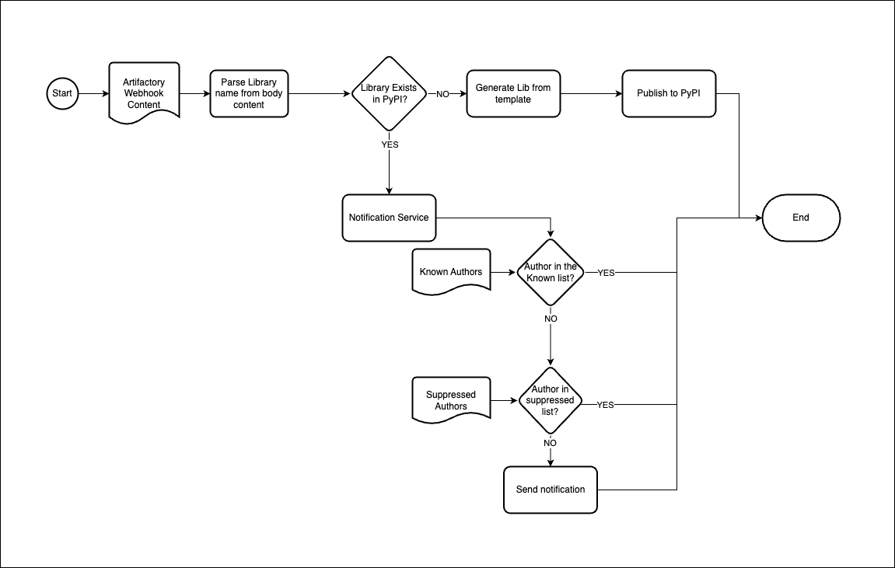

# Python Artifactory Dependency Confusion Patch

This application is intended to be used together with Artifactory webhook to reserve name in the python public repository. When new python libraries are deployed to the internal artifactory repository the webhook notifies the application and the name is reserved if available.

## Python Dependency Confusion Supply Chain Attack

Lately, supply chain attack vector are being more and more popular, it became known by a broad audience by the blog post [Dependency Confusion: How I Hacked Into Apple, Microsoft and Dozens of Other Companies](https://medium.com/@alex.birsan/dependency-confusion-4a5d60fec610) and python environment is prone to be attacked.

The python dependency manager protocol, if not configured properly, can be used to breach into the application confusing the protocol to install a package from a bad actor instead of the intended package. The most common misconfiguration is adding a private repository to the tool and letting it decide which version/package to download between the public and the private repository. By default, it will pick the package with the higher version.

A way to exploit it's to deploy a know library from a private repository into the public repository with a very high version (i.e. version 999.9.9), confusing the tool to install the package with higher version.

## Artifactory

[JFROG Artifactory](https://jfrog.com/artifactory/) is a popular private artifact repository that almost other features can be used as a private repository for python libraries. Artifactory has built in [features](https://jfrog.com/blog/addressing-the-npm-manifest-confusion-vulnerability/) to help with dependency confusion attacks, but by itself it can't solve the problem if the dependency management tool is not configured properly.

## Patching

The strategy of this application is to *reserve the name on the public repository* to avoid it being taken by a bad actor and used as an attack vector. If the name is already taken it (optionally) sends a notification to a slack webhook.

It leverages the Artifactory [webhook](https://jfrog.com/help/r/jfrog-platform-administration-documentation/predefined-webhooks) for `deployed` events to reserve the name.

The package is meant to be used on an application that receives the Artifactory webhook `POST` request and send the JSON content to the library, as in the usage example.

### Flowchart



### Usage Example

Usage example [code](./docs/cloud_function_example.py) ([requirements.txt](./docs/gcf_requirements.txt)) in a google cloud function:

```python
import functions_framework
import traceback
import logging
from python_artifactory_dependency_confusion_patch import NotificationService, SlackNotification
from python_artifactory_dependency_confusion_patch import PublicNameReserver

logger = logging.getLogger("python_artifactory_dependency_confusion_patch")

notification_system = SlackNotification("<slack url>")
notification_service = NotificationService(notification_system, known_emails={"fix deps <fix@python.deps>"})
name_reserver = PublicNameReserver(notification_service)


@functions_framework.http
def reserve_name(request):
    """HTTP Cloud Function.
    Args:
        request (flask.Request): The request object.
        <https://flask.palletsprojects.com/en/1.1.x/api/#incoming-request-data>
    Returns:
        The response text, or any set of values that can be turned into a
        Response object using `make_response`
        <https://flask.palletsprojects.com/en/1.1.x/api/#flask.make_response>.
    """
    request_json = request.get_json(silent=True)
    try:
        name_reserver.reserve_name_from_artifactory_body(request_json)
    except Exception as exc:
        print(f"Failed to process request {request_json}")
        print(traceback.format_exc())

    return ("", 200)

```

Note: `"fix deps <fix@python.deps>"` is the author email from the template